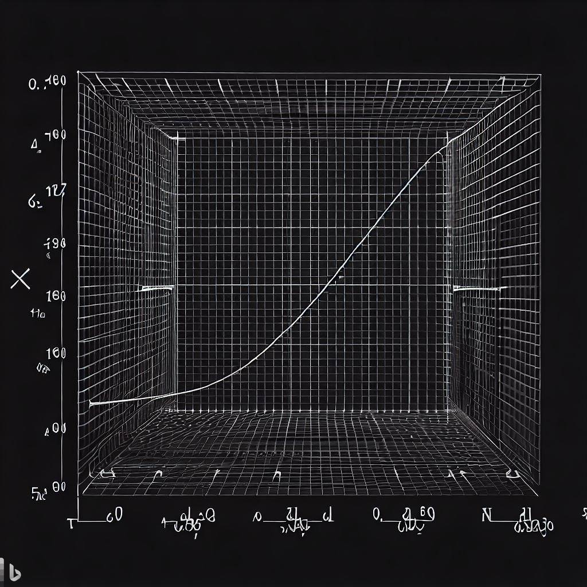
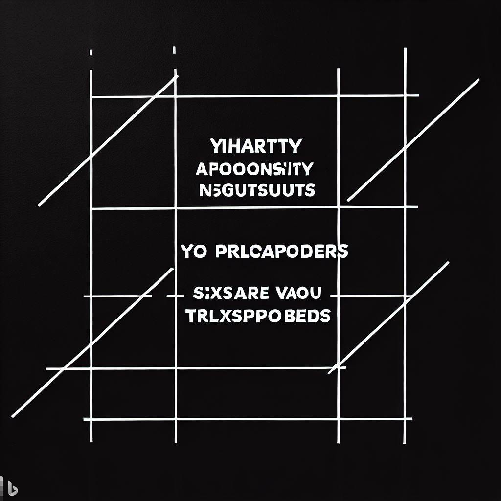

:stem: latexmath
:docinfo: shared
:customcss: ./theme.css
:linkcss:
:revealjs_theme: black
:revealjs_progress: false
:revealjs_transition: none
:revealjs_controlsLayout: edges
:revealjs_controlsTutorial: false
:revealjs_disablelayout: true
:revealjs_center: false
:revealjs_navigationMode: linear
:revealjs_history: true

[.title]
== Special Relativity in Compact Spacetimes

Brian Greene +
Professor of Physics & Mathematics +
Columbia University

== Special Relativity

[%step]
* REALITY has unexpected features that become manifest at high speeds.
[%step]
** From the perspective of stationary observer:
[%step]
*** Moving clocks run slow (by factor of ++\(\gamma=1/\sqrt{1-v^2/c^2}\)++)
*** Moving objects appear shortened (by factor of ++\(\gamma\)++)
*** Moving object’s mass grows with speed (by factor ++\(\gamma\)++)

== Twin Paradox

[%step]
* Final thought
* Who is moving

[%step]
[sidebar]
====
The Twin “Paradox”
====

[%step]
* Usual solution: to compare watches, one twin must accelerate
* New twist: Spatial direction is compact, say a circular dimension

== INSERT TITLE HERE

[sidebar]
====
NEED ANIMATION OF TWO OBSERVERS ON A CIRCLE IN RELATIVE MOTION
====

== Compact Twin Paradox

* [.hl]#Qualitative Solution#

== INSERT TITLE HERE

[sidebar]
====
ANIMATION: LIGHT BEAM ANIMATION. LEFT AND RIGHT BEAMS
====

== Compact Twin Paradox

* [.hl]#Qualitative Solution#
** There is a [.hl]#preferred# frame of reference
** All other frames of reference are in motion relative to preferred frame

[.columns.wrap-cols]
== Special Relativity on a circle: Mathematical Setup

[.column]
* Spacetime diagrams
** Traversing the circle, identify ++\(z\to z+2\pi R\)++
** Yellow dots on same horizontal time slice are identified as the same point (by all observers)
+
[.columns]
--
[.column]

[.column]

--
